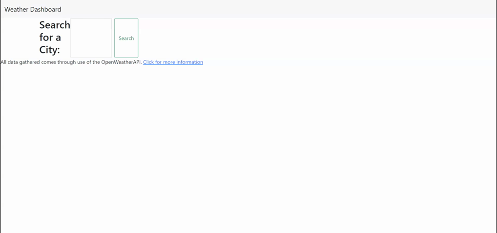

# WeatherDashboard
Ever wanted an ad-free Weather information app. Look no further. This app will give you the current weather for your location as well as the a forecast for next 5 days. Your cities will be saved to your local computer, making it an easy reference for future visits.
## Project Summary
This app will be search the OPENWEATHER API and bring back user inputted city. The City will have its current weather displayed, along with the next 5 day forecast. Information included will be current temp, wind, humidity and forecast (ie. clouds, sunny etc)
The current weather will also display the UV index and color code it according to the EPA UV index guideline. As a new city is searched, a new button is created, unless it has originally been searched before and the button is already present. The city is saved in the user's local storage. When the app is reloaded, previously searched cities are loaded onto the screen below the search bar as their own buttons. Clicking them will show their current weather and forecast, same as searching for a new city.

## Project Process
As with working with any new API, I first began reading the documentation of the API to understand the parameters surrounding pull requests. I learned about the current weather, one call and a 5 day forecast. I saw that for one call you needed coordinates. Instead of using another API, using the "current" weather call, a city name can be used to not only generate the current weather for that city, but also includes the coordinates (among other interesting pieces of information such as population). Taking these coordinates I was able to load them into the one call to obtain the UV index. Finally, the future forecast is found through the 5 day forecast call. A for loop was used to only grab the next 5 days.

## Link to App
https://pricosaint.github.io/WeatherDashboard/

## Project screenshot
